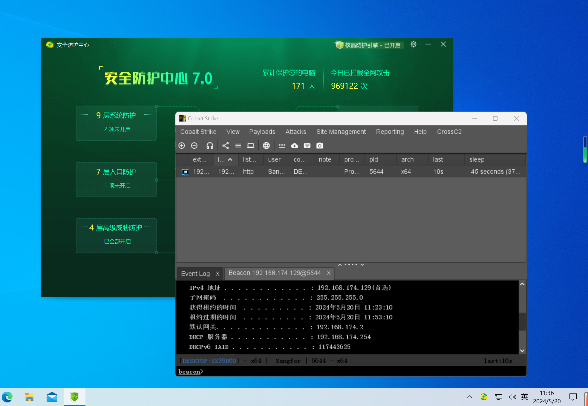
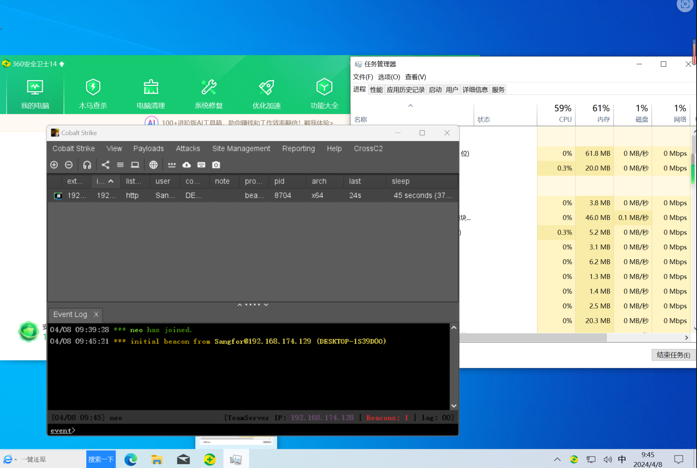
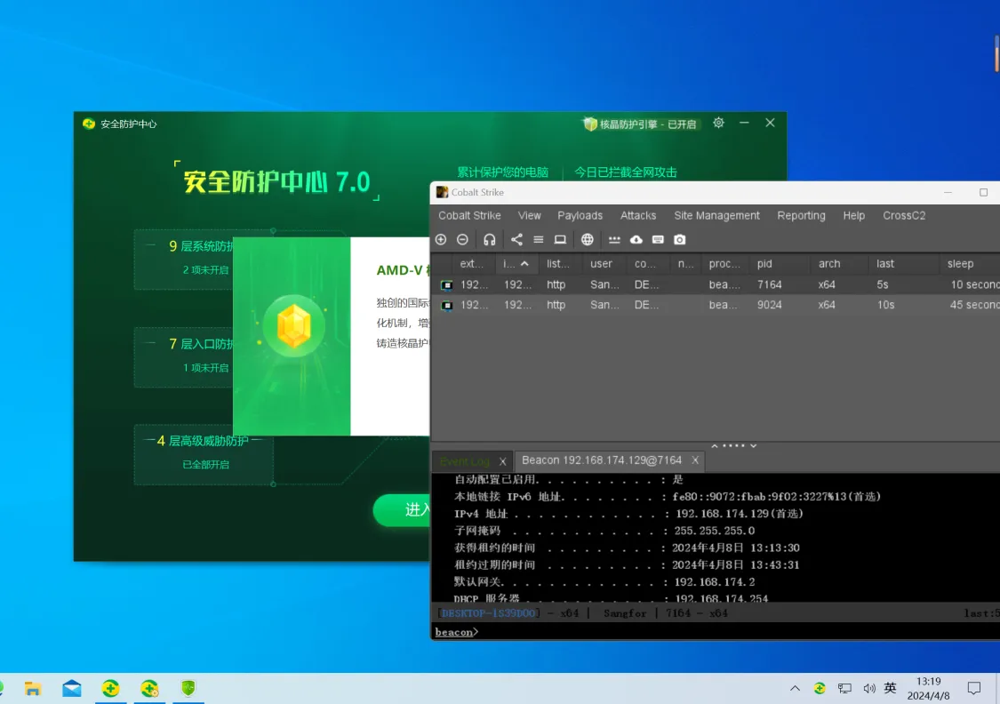

darkPulse是一个用go编写的shellcode Packer，用于生成各种各样的shellcode loader,目前可过火绒，360，360核晶。

## 特点

- 使用sgn编码，使用了 [EgeBalci/sgn ](https://github.com/EgeBalci/sgn)提供的二进制文件。
- 支持aes/xor加密，uuid/words混淆，支持间接syscall和unhook两种模式下的callback，fiber，earlybird三种加载方式。

- 间接sysacll参考了SysWhispers3的项目，链接：[klezVirus/SysWhispers3](https://github.com/klezVirus/SysWhispers3)

- unhook使用了 [自定义跳转函数的unhook方法](https://killer.wtf/2022/01/19/CustomJmpUnhook.html) 文中所讲述的方法，文中提到的github仓库 [trickster0/LdrLoadDll-Unhooking](https://github.com/trickster0/LdrLoadDll-Unhooking) 只实现了64位下的demo，我在 [LdrLoadDll-Unhooking-x86-x64](https://github.com/fdx-xdf/LdrLoadDll-Unhooking-x86-x64) 中完善了32位和64位通用的一段代码。

## 使用方法

### C模板

首先要配好gcc的环境，命令行运行`gcc -v` 有反应

个人测试gcc版本

`gcc version 8.1.0 (x86_64-posix-sjlj-rev0, Built by MinGW-W64 project)`

如果不一样可能会出现bug

### Rust模板

注意：目前Rust模板只支持Unhook选项。

配置环境参考文章 [Windows 下使用MSYS2，GNU，非MSVC环境安装Rust方法 ](https://zhuanlan.zhihu.com/p/613466378)，个人安装的是 nightly 版本，但是stable版本应该也可以。

个人工具链配置

```
C:>rustup toolchain list
nightly-i686-pc-windows-gnu
nightly-x86_64-pc-windows-gnu (default)
```

其中 i686 是为了编译32位下目标设置的，可以使用`rustup default nightly-x86_64-pc-windows-gnu`调整默认工具链，工具使用时默认64位工具链就可以，但是如果需要编译32位loader需要安装 i686 的工具链，在上面的参考文章对应地方稍微改一下就行。

### 其他说明

为了规避内存扫描会休眠10s左右，所以并不能一下就上线

在实战中推荐使用-sandbox参数，针对不同机器情况大概会休眠40s

开源之后免杀性能肯定会有所下降，但是程序提供了多个参数可以选择，有的参数组合还是可以Bypass的。

_            _    _____       _

示例1：

```
darkPulse.exe -i calc_shellcode.bin -h
      _            _    _____       _
     | |          | |  |  __ \     | |
   __| | __ _ _ __| | _| |__) |   _| |___  ___
  / _` |/ _` | '__| |/ /  ___/ | | | / __|/ _ \
 | (_| | (_| | |  |   <| |   | |_| | \__ \  __/
  \__,_|\__,_|_|  |_|\_\_|    \__,_|_|___/\___|

                    author fdx_xdf
                    version 2.0
                    2024.05

Usage:
    
  -h <help>: 显示帮助信息
  -i <path>: 原始格式 Shellcode 的路径
  -enc <encryption>: Shellcode加密方式 (默认: aes)
  -lang <language>: 选择加载器的语言 (默认为 'c'，可选值: c,rust)
  -o <output>: 输出文件 (默认: Program)
  -k <keyLength>: 加密的密钥长度 (默认: 16)
  -obf <obfuscation>: 混淆Shellcode以降低熵值 (默认: uuid)
  -f <framework>: 目标架构32位还是64位
  -sandbox <true/false>: 是否开启反沙箱模式 (默认: true)
  -unhook <true/false>: 是否开启unhook模式 (默认: false,使用间接syscall加载)
  -loading <loadingTechnique>: 请选择加载方式，支持callback, fiber, earlybird (默认: callback)
  -debug  <true/false>: 是否打印shellcode中间加密/混淆过程(默认为 'false'，即不打印)
```

示例2：

```
darkPulse.exe -i calc_shellcode.bin -f 32 -sandbox -unhook
      _            _    _____       _
     | |          | |  |  __ \     | |
   __| | __ _ _ __| | _| |__) |   _| |___  ___
  / _` |/ _` | '__| |/ /  ___/ | | | / __|/ _ \
 | (_| | (_| | |  |   <| |   | |_| | \__ \  __/
  \__,_|\__,_|_|  |_|\_\_|    \__,_|_|___/\___|

                    author fdx_xdf
                    version 1.2
                    2024.05
[+] 开始为您打包exe

[+] 正在使用 sgn 工具进行编码

[+] 进行sgn编码后的shellcode: 0xe8, 0xe7, 0x00, 0x00, 0x00, 0xeb, 0x04, 0xf7, 0xc8, 0xb9, 0xd8, 0x00, 0x00, 0x00, 0x74, 0x28, 0x35, 0x53, 0xcf, 0x00, 0x00, 0x00, 0x16, 0x22, 0x6c, 0x73, 0x4c, 0xd0, 0x90, 0xbb, 0x18, 0x06, 0xc5, 0x9d, 0xc8, 0x9c, 0x24, 0x28, 0x6e, 0xc8, 0x1b, 0xc4, 0x02, 0x02, 0xfe, 0x16, 0x94, 0x94, 0x94, 0x54, 0x22, 0x23, 0xa4, 0x15, 0x15, 0x6d, 0xc6, 0x56, 0x50, 0xdb, 0x71, 0x79, 0xf2, 0x98, 0x8a, 0xfd, 0x4f, 0x57, 0x16, 0x1d, 0x17, 0x31, 0xfe, 0xf9, 0x25, 0xd9, 0x40, 0x38, 0x22, 0xce, 0xec, 0x91, 0x5c, 0x51, 0x4e, 0x45, 0x47, 0x31, 0x5b, 0x0a, 0x7d, 0x0f, 0x1f, 0x00, 0x32, 0x08, 0x7b, 0x37, 0xd6, 0x28, 0xcb, 0x83, 0x60, 0x31, 0x5e, 0x25, 0x7c, 0x5a, 0x5b, 0x76, 0xfd, 0x84, 0x5a, 0x45, 0x7f, 0x20, 0x43, 0x67, 0xea, 0xc3, 0xd5, 0x1a, 0x95, 0xb9, 0x66, 0x91, 0x9a, 0x13, 0xa4, 0x5c, 0x32, 0xa7, 0x4d, 0xac, 0x21, 0xa5, 0x5c, 0xd9, 0xfd, 0x40, 0x14, 0x4a, 0x31, 0x61, 0x45, 0xa2, 0x6d, 0x0b, 0x78, 0x62, 0x15, 0x1e, 0x36, 0x28, 0x85, 0x40, 0xc3, 0xb7, 0x3a, 0xbb, 0x6b, 0xda, 0x5e, 0x72, 0xa0, 0xfb, 0x5e, 0xbf, 0xd6, 0x6a, 0xc3, 0xbc, 0xa2, 0xc1, 0x1e, 0x32, 0xb5, 0x57, 0xa2, 0x8f, 0x02, 0x66, 0x57, 0xd0, 0x11, 0xa3, 0xa3, 0xa3, 0x03, 0x83, 0x8b, 0xa4, 0xaf, 0xbe, 0xc5, 0xb0, 0x11, 0x4a, 0xb0, 0xc1, 0x5b, 0xcd, 0x59, 0xff, 0x10, 0x8d, 0xee, 0xe9, 0x3c, 0xfc, 0x02, 0x7e, 0x74, 0x02, 0xf9, 0xd1, 0x9a, 0x5f, 0xda, 0x99, 0x6a, 0xc6, 0x55, 0x3f, 0xbf, 0x12, 0xcd, 0xd6, 0x35, 0x84, 0xe6, 0x79, 0x97, 0x02, 0x70, 0x15, 0x89, 0xc0, 0xeb, 0x04, 0x01, 0x5d, 0xcd, 0x58, 0x5b, 0xc1, 0x4b, 0x06, 0x17, 0xeb, 0x04, 0x06, 0x79, 0xc5, 0xf8, 0x0f, 0x46, 0xd2, 0x81, 0x6b, 0x0a, 0x28, 0xd7, 0x99, 0x0a, 0xeb, 0x04, 0xc6, 0xe0, 0xfd, 0x61, 0xc1, 0x4b, 0x0e, 0x9d, 0xeb, 0x04, 0xac, 0x15, 0xdb, 0x80, 0x81, 0x73, 0x12, 0x37, 0x5c, 0xf7, 0x42, 0xeb, 0x00, 0xeb, 0x04, 0xd5, 0x7e, 0xed, 0x06, 0x81, 0x73, 0x16, 0xc7, 0x90, 0xbb, 0x18, 0xeb, 0x04, 0x71, 0x5f, 0x24, 0x89, 0x81, 0x6b, 0x1a, 0x04, 0x41, 0x8f, 0xb1, 0xeb, 0x04, 0x15, 0x91, 0x47, 0xfa, 0x81, 0x6b, 0x1e, 0x9c, 0x24, 0x28, 0x8c, 0xeb, 0x04, 0x9b, 0x0f, 0x5b, 0x0a, 0x81, 0x73, 0x22, 0x38, 0x1f, 0xf5, 0xf8, 0xff, 0xe3

[+] Generated AES key: 0x36, 0x37, 0x54, 0x4c, 0x37, 0x4d, 0x78, 0x53, 0x69, 0x52, 0x53, 0x59, 0x32, 0x47, 0x49, 0x67

[+] Generated IV (16-byte): 0x52, 0x42, 0x62, 0x4c, 0x6e, 0x69, 0x4f, 0x5a, 0x44, 0x44, 0x43, 0x4d, 0x6d, 0x6e, 0x58, 0x
63

[+] Using AES-128-CBC encryption

[+] 进行加密后的shellcode：0x11, 0xef, 0xfd, 0x48, 0x48, 0x69, 0x4f, 0x7e, 0xa7, 0x8d, 0x7d, 0x9a, 0x3c, 0xaf, 0x0b, 0x2f, 0xfc, 0xc7, 0x1f, 0xaa, 0xaf, 0x8d, 0x3b, 0x2f, 0x55, 0x55, 0x0e, 0xa1, 0x95, 0x62, 0x85, 0xc3, 0xc1, 0xa5, 0x67, 0x82, 0x65, 0x38, 0x90, 0x39, 0x20, 0x67, 0x86, 0x6a, 0x5c, 0x18, 0x53, 0x1b, 0xa1, 0x87, 0x1e, 0x9e, 0x70, 0xb1, 0x2e, 0x38, 0x67, 0x0d, 0xe7, 0x2f, 0x3e, 0x3f, 0x49, 0x17, 0xaf, 0x2d, 0x98, 0xcd, 0x68, 0x7d, 0x84, 0x49, 0x35, 0x4d, 0xa5, 0xc5, 0xe3, 0x89, 0xa7, 0x5f, 0x86, 0x6a, 0x72, 0xfa, 0x95, 0x27, 0x60, 0xe7, 0x6f, 0x3a, 0x62, 0x7e, 0x07, 0x1f, 0xc8, 0x11, 0x89, 0xc0, 0x34, 0xb4, 0x0f, 0x65, 0xe6, 0xe3, 0x8e, 0xdb, 0x78, 0x4e, 0x29, 0x51, 0xa2, 0xb2, 0xbf, 0xc8, 0xe7, 0x74, 0x5c, 0xb6, 0x98, 0xec, 0x25, 0xe4, 0x85, 0x9a, 0x08, 0xdc, 0xaf, 0xe9, 0x55, 0xa5, 0xf7, 0x5e, 0x23, 0x66, 0xc1, 0x68, 0xb0, 0xd1, 0x58, 0xa2, 0x68, 0x76, 0x4d, 0xcd, 0x95, 0x5e, 0xf0, 0x1e, 0x2f, 0xd9, 0xca, 0x01, 0xe7, 0x0b, 0x9e, 0x0a, 0x4c, 0x35, 0xe1, 0x83, 0x31, 0xfc, 0x82, 0xa7, 0xbb, 0x20, 0x5d, 0xe2, 0xe0, 0xc3, 0xff, 0xbb, 0x2f, 0xfa, 0xed, 0xdd, 0x3c, 0xfd, 0x37, 0x3f, 0x5b, 0x19, 0x58, 0xa3, 0xa9, 0xf2, 0x0f, 0x77, 0x41, 0x5e, 0x72, 0xb8, 0x20, 0x61, 0x8b, 0x24, 0x64, 0x12, 0x64, 0x99, 0x73, 0x1f, 0xe2, 0x64, 0xa4, 0x07, 0x84, 0xfe, 0x26, 0x4d, 0x29, 0x89, 0xde, 0xcd, 0x5a, 0x91, 0x48, 0x22, 0x4e, 0x22, 0x20, 0x8a, 0x05, 0x03, 0xb8, 0xea, 0x30, 0x86, 0x36, 0x62, 0xbf, 0xdd, 0x71, 0x4d, 0xd2, 0x0c, 0x56, 0x35, 0x8c, 0x87, 0x39, 0x26, 0xc6, 0xc1, 0xef, 0xad, 0xf5, 0x62, 0x2c, 0x09, 0xe3, 0xab, 0xf3, 0x18, 0xb7, 0xa8, 0x2a, 0xcc, 0xdb, 0xf0, 0xd4, 0x38, 0x4e, 0x58, 0x14, 0xa6, 0x4b, 0x7e, 0x9e, 0xba, 0x3e, 0x4f, 0xf3, 0xe8, 0x60, 0xb0, 0x46, 0xa9, 0x5d, 0x98, 0xb9, 0x7d, 0x0a, 0x35, 0x9d, 0xbf, 0x29, 0x8a, 0x79, 0x99, 0x96, 0x8e, 0xd7, 0xbc, 0x77, 0x36, 0xa5, 0xe6, 0x39, 0x3f, 0x32, 0x70, 0x5e, 0x75, 0x9b, 0xd7, 0xb9, 0x24, 0xa9, 0x24, 0x78, 0x80, 0x70, 0x9f, 0x80, 0x2a, 0x43, 0x0f, 0x04, 0xea, 0xd0, 0xba, 0x22, 0x2c, 0x4e, 0x20, 0x64, 0x65, 0x8a, 0x15, 0xc7, 0x28, 0x32, 0x4e, 0xa3, 0x8c, 0x16, 0xf7, 0x3d, 0xee, 0x79, 0x8b, 0x75, 0x4b, 0xdc, 0x3a, 0x27, 0xb6, 0xfc, 0x41, 0x9b, 0x40

[+] Generated UUIDs:"48fdef11-6948-7e4f-a78d-7d9a3caf0b2f",
                    "aa1fc7fc-8daf-2f3b-5555-0ea1956285c3",
                    "8267a5c1-3865-3990-2067-866a5c18531b",
                    "9e1e87a1-b170-382e-670d-e72f3e3f4917",
                    "cd982daf-7d68-4984-354d-a5c5e389a75f",
                    "fa726a86-2795-e760-6f3a-627e071fc811",
                    "b434c089-650f-e3e6-8edb-784e2951a2b2",
                    "74e7c8bf-b65c-ec98-25e4-859a08dcafe9",
                    "5ef7a555-6623-68c1-b0d1-58a268764dcd",
                    "1ef05e95-d92f-01ca-e70b-9e0a4c35e183",
                    "a782fc31-20bb-e25d-e0c3-ffbb2ffaeddd",
                    "3f37fd3c-195b-a358-a9f2-0f77415e72b8",
                    "248b6120-1264-9964-731f-e264a40784fe",
                    "89294d26-cdde-915a-4822-4e22208a0503",
                    "8630eab8-6236-ddbf-714d-d20c56358c87",
                    "c1c62639-adef-62f5-2c09-e3abf318b7a8",
                    "f0dbcc2a-38d4-584e-14a6-4b7e9eba3e4f",
                    "b060e8f3-a946-985d-b97d-0a359dbf298a",
                    "8e969979-bcd7-3677-a5e6-393f32705e75",
                    "24b9d79b-24a9-8078-709f-802a430f04ea",
                    "2c22bad0-204e-6564-8a15-c728324ea38c",
                    "ee3df716-8b79-4b75-dc3a-27b6fc419b40",

[+] 正在为您生成模板文件: Program.c

[+] 编译成功: Program.exe
```

即在当前目录下生成 Program.exe

注意：syscall下的earlybird方式由于某些bug并没有使用间接syscall方式加载，尽量不要使用。

## 更新日志

2024.5.20	解决了部分bug，新增 rust 模板，使用方法见上面说明

2024.5.4	解决了部分bug，新增加 sgn 编码工具，增加静态规避效果

2024.5.1	优化了错误提示，解决了部分bug，优化了unhook模板，新增debug模式，可以选择是否打印中间加密/混淆过程，新增加编译好的Mac可执行文件

## 实现效果

5.20 新增Rust模板，测试如下：




5.1日师傅们的测试


微步云沙箱无检出


360（未开核晶）：无检出



火绒：无检出


360（开启核晶）：无检出（使用syscall和unhook两种方式生成的exe均成功绕过核晶）



## to do list:

- Rust 模板
- ~~更多加密算法(由于使用了sgn编码，加密其实没有那么大的必要了)~~
- 分离加载
- ~~- unhook~~
- .....

## 免责声明

本项目仅用安全研究的学习交流和研究，强烈不建议您用于任何的实际途径（包括黑灰产交易、非法渗透攻击、割韭菜），网络不是法外之地！如果您使用该工具则应该自觉遵守以上要求。

如果遇到问题可以提交issue，也可以通过企鹅号联系我：MTM1MDE0MTk0MA==

## Stargazers over time
[](https://starchart.cc/fdx-xdf/darkPulse)

